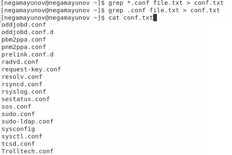
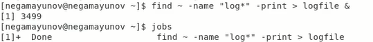
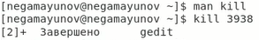
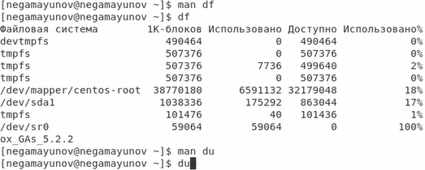

<!-- _class: titleslide -->
# Лабораторная работа №7
### Выполнил Гамаюнов Никита, 1032201719, НПМбд-01-20

---
# Прагматика выполнения работы
**Цель:** Ознакомление с инструментами поиска файлов и фильтрации текстовых данных. Приобретение практических навыков: по управлению процессами (и заданиями), по проверке использования диска и обслуживанию файловых систем.
Приобретение навыков практической работы по просмотру каталогов и файлов; манипуляций с ними.

**Задача:**  Ознакомиться с инструментами поиска файлов и фильтрации текстовых данных, приобрести практические навыки: по управлению процессами (и заданиями), по проверке использования диска и обслуживанию файловых систем.

---

# Процесс выполнения работы
1. Записал в файл file.txt названия файлов, содержащихся в каталоге /etc

    

2. Вывел имена всех файлов из file.txt, имеющих расширение.conf, после чего записал их в новый текстовой файл conf.txt.

    

---

3. Определил, какие файлы в домашнем каталоге имеют имена, начинавшиеся с символа **c**. Есть два способа сделать это:
   1. C помощью grep
   
       

    2. С помощью find

       

---
4. Запустил в фоновом режиме процесс, записывающий в файл ~/logfile файлы, имена которых начинаются с log

    

5. Запустил из консоли в фоновом режиме редактор gedit и двумя способами определил его идентификатор

    
    

---
6. Прочитал справку команды kill и воспользовался ей 
   
   

7. Точно так же изучил df и du

    

---

<!-- _class: titleslide -->
# Выводы
Я ознакомился с инструментами поиска файлов и фильтрации текстовых данных. Приобрёл практические навыки: по управлению процессами (и заданиями), по проверке использования диска и обслуживанию файловых систем.