
 

# Лабораторная работа №8 

**По дисциплине Операционнные системы** 

Выполнил Гамаюнов Н.Е., студент ФФМиЕН РУДН, НПМбд-01-20, 1032201717

Преподаватель Кулябов Дмитрий Сергеевич

Москва, 2021 г.

 

# Цель работы
Ознакомление с инструментами поиска файлов и фильтрации текстовых данных. Приобретение практических навыков: по управлению процессами (и заданиями), по проверке использования диска и обслуживанию файловых систем.

# Задания
Ознакомиться с инструментами поиска файлов и фильтрации текстовых данных, приобрести практические навыки: по управлению процессами (и заданиями), по проверке использования диска и обслуживанию файловых систем.

# Выполнение лабораторной работы
1. Осуществил вход в систему, используя соответствующее имя пользователя *(рисунок 1)*

    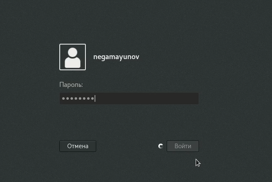

    Рисунок 1.

2. Записал в файл file.txt названия файлов, содержащихся в каталоге /etc *(рисунок 2)*

    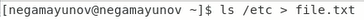

    Рисунок 2.

3. Вывел имена всех файлов из file.txt, имеющих расширение.conf, после чего записал их в новый текстовой файл conf.txt *(рисунок 3)*

    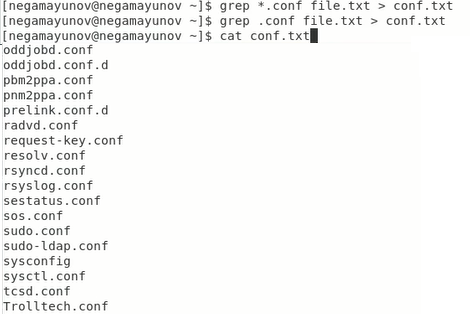

    Рисунок 3.

4. Определил, какие файлы в домашнем каталоге имеют имена, начинавшиеся с символа **c**. Есть два способа сделать это:
   1. C помощью grep *(рисунок 4)*
   
       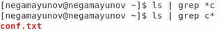

      Рисунок 4.

    2. С помощью fing *(рисунок 5)*

       

        Рисунок 5.

5. Вывел на экран (по странично) имена файлов из каталога /etc, начинающиеся с символа h *(рисунок 6)*

    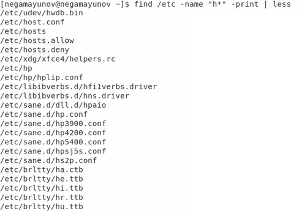

    Рисунок 6.

6. Запустил в фоновом режиме процесс, записывающий в файл ~/logfile файлы, имена которых начинаются с log *(рисунок 7)*

    

    Рисунок 7.

7. Удалил файл ~/logfile. *(рисунок 8)*

    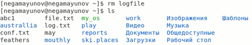

    Рисунок 8.

8. Запустил из консоли в фоновом режиме редактор gedit *(рисунок 9)*

    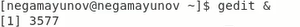

    Рисунок 9.

9. Определил идентификатор процесса gedit, используя команду ps, конвейер и фильтр grep *(рисунок 10)*. Можно было опредеить PID проще, например, оно уже было выведено при запуске процесса (нижняя строка на рисунке 9)

    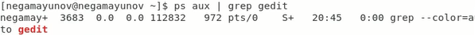

    Рисунок 10.

10. Прочел справку (man) команды kill, после чего использовал её для завершения процесса gedit *(рисунок 11)*

    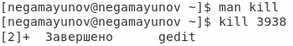

    Рисунок 11.

11. Выполнил команды df и du, предварительно получив более подробную информацию об этих командах, с помощью команды man *(рисунок 12)*

    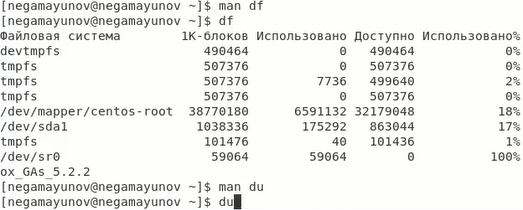

    Рисунок 12.

12. Воспользовавшись справкой команды find, вывел имена всех директорий, имеющихся в вашем домашнем каталоге *(рисунок 13)*

    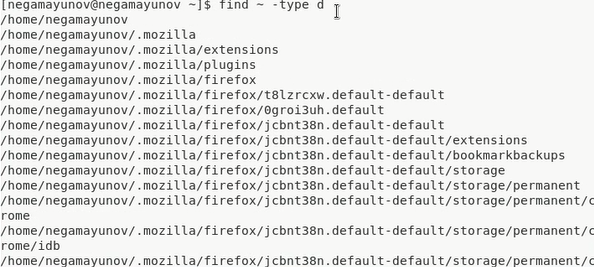

    Рисунок 13.

# Выводы
Я ознакомился с инструментами поиска файлов и фильтрации текстовых данных. Приобрёл практические навыки: по управлению процессами (и заданиями), по проверке использования диска и обслуживанию файловых систем.

*Источник всей информации, которой я пользовался - [методические рекомедации к лабораторной работе](https://esystem.rudn.ru/pluginfile.php/1142078/mod_resource/content/2/004-lab_proc.pdf)*

# Библиография
- [Кулябов Д. С. и др. Операционные системы. Методические рекомендации к лабораторной работе №7](https://esystem.rudn.ru/pluginfile.php/1142078/mod_resource/content/2/004-lab_proc.pdf)
